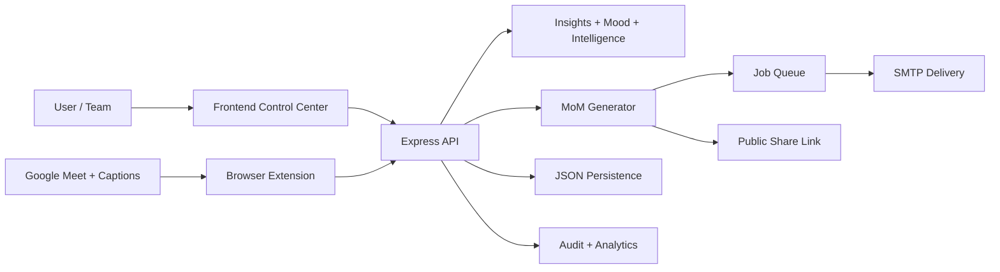

# MOM AI

**Real-Time Meeting Intelligence Platform**  
Capture live conversations, generate actionable Minutes of Meeting, and ship decisions to every attendee with traceable delivery.

---

## Live Demo

- Local App: `http://localhost:4000`
- Public Repo: `https://github.com/abhay-codes07/MOM`
- Demo video/GIF placeholders:
  - `./docs/demo-live-capture.gif`
  - `./docs/demo-mom-generation.gif`

---

## What is MOM AI?

MOM AI is a real-time meeting operations system that combines manual notes, Google Meet caption ingestion, transcription workflows, intelligence scoring, and asynchronous MoM delivery.

It is built to convert meeting noise into structured outcomes:
- mood
- decisions
- action items
- reminders
- delivery status
- audit trail

---

## Badges


---

## Key Features

- Real-time meeting lifecycle (start, notes, end, MoM generation)
- Google Meet live caption hook via browser extension
- Automatic meeting mood inference at top of MoM
- Insight extraction (summary, agenda highlights, decisions, action items)
- Meeting intelligence score + keyword signal map
- AI risk radar from conversational signals
- AI follow-up draft generator for attendee emails
- Smart action parsing (owner + due hint extraction)
- Next-meeting agenda synthesis
- MoM version history + compare diff
- Shareable public MoM links (read-only)
- Async email queue with retry/backoff
- Action reminder scheduling from open action items
- Admin analytics, audit logs, and job visibility

---

## Demo Capabilities

### 1) Live Meeting Assistant
- Ingest typed notes or live captions
- Generate structured MoM in seconds

### 2) Delivery + Reliability
- Queue MoM emails
- Track status (`queued`, `processing`, `succeeded`, `failed`)

### 3) Competitive Intelligence Layer
- Score meeting quality
- Surface medium/high risk signals early
- Generate next agenda automatically
- Draft follow-up emails for attendees
- Schedule action reminders

### 4) Governance Layer
- Auth-protected APIs
- Audit timeline for key operations
- Persistent state in JSON store

---

## Architecture

```text
MOM/
├── public/
│   ├── index.html         # Premium frontend layout
│   ├── styles.css         # Glassmorphism + neumorphism design system
│   └── app.js             # UI interactions + API orchestration
├── browser-extension/
│   ├── manifest.json
│   ├── popup.html
│   ├── popup.js
│   └── content.js         # Google Meet live caption capture + recording badge
├── src/
│   ├── server.js          # API, auth guards, queue worker, orchestration
│   ├── auth.js
│   ├── persistence.js
│   ├── queue.js
│   ├── audit.js
│   ├── transcription.js
│   ├── meeting-intelligence.js
│   ├── ai-ops.js
│   ├── mom-versioning.js
│   └── reminder-jobs.js
├── scripts/
│   ├── phase4-demo.ps1
│   └── phase5-demo.ps1
└── docs/
    ├── PHASE5_RUNBOOK.md
    └── COMPETITIVE_FEATURES.md
```

### System Flow (Mermaid)



---

## Real-Time Streaming Pipeline

1. Meeting starts in MOM app
2. Extension captures live captions from Meet tab (when captions are ON)
3. Caption batches are posted to `/api/hooks/meeting-context`
4. Notes are normalized into speaker-aware entries
5. End meeting triggers MoM generation + mood + insights
6. Email delivery is queued and processed asynchronously

---

## Tech Stack

### Frontend
- Vanilla JS SPA (`public/index.html`, `public/app.js`)
- Inter font
- Phosphor icons
- Premium visual system (glassmorphism, neumorphism, reveal animations)

### Backend
- Node.js
- Express
- Nodemailer v8
- UUID
- Dotenv

### Real-Time / Integration
- Chrome Extension (Manifest V3)
- Google Meet caption DOM ingestion
- Hook-based streaming into backend

### Ops / Reliability
- Persistent JSON store
- Retryable async job worker
- Audit + analytics endpoints

---

## Performance Notes

Observed in local smoke runs:
- End-to-end MoM generation: near-instant after `/end`
- Queue processing loop interval: default `2000ms`
- Live caption push cadence from extension: ~`1500ms` batches
- Reminder jobs and MoM jobs both processed by same retryable worker

---

## Installation

```bash
git clone https://github.com/abhay-codes07/MOM.git
cd MOM
npm install
copy .env.example .env
npm run dev
```

Open: `http://localhost:4000`

---

## Development

### Run App

```bash
npm run dev
```

### Security/Audit Check

```bash
npm audit
```

### Demo Scripts

```powershell
powershell -ExecutionPolicy Bypass -File scripts/phase4-demo.ps1
powershell -ExecutionPolicy Bypass -File scripts/phase5-demo.ps1
```

---

## API Highlights

### Auth
- `POST /api/auth/login`
- `GET /api/auth/me`

### Meetings
- `POST /api/meetings/start`
- `POST /api/meetings/:id/notes`
- `POST /api/meetings/:id/end`
- `POST /api/meetings/:id/send-mom`
- `POST /api/meetings/:id/share-mom`

### Intelligence Pack
- `GET /api/meetings/:id/intelligence`
- `GET /api/meetings/:id/agenda-next`
- `GET /api/meetings/:id/risk-radar`
- `GET /api/meetings/:id/followup-drafts`
- `GET /api/meetings/:id/mom-versions`
- `GET /api/meetings/:id/mom-versions/:versionId/compare?to=latest`
- `POST /api/meetings/:id/schedule-reminders`

### Admin
- `GET /api/jobs`
- `GET /api/admin/analytics`
- `GET /api/admin/audit`

---

## Screenshots (Placeholders)


---

## Roadmap

- Native provider connectors beyond Meet DOM capture
- Better speaker diarization and confidence scoring
- Team workspaces + role-based access controls
- Database backend migration (Postgres)
- Production observability dashboards and alerting
- Scheduled recurring meeting playbooks

---

## Contributing

Contributions are welcome.  
For major changes, open an issue first with scope, use-case, and expected API/UI behavior.

---

## Contributors

- **Abhay Singh** (Project Owner)  
  GitHub: `@abhay-codes07`

---

## License

MIT License.

---

Built for high-velocity teams that want decisions, accountability, and operational clarity from every meeting.
